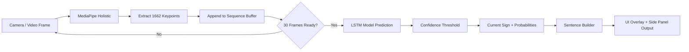
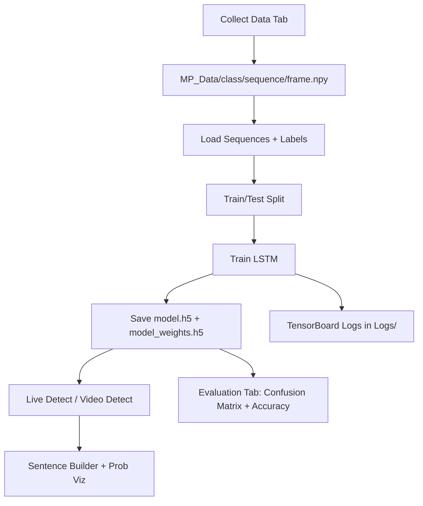

# Sign Language Detection — Desktop Application

A desktop-first deep learning application for end-to-end sign language workflow management: camera preview, dataset capture, model training, real-time detection, video-file detection, and evaluation in one interface.

---

## Introduction / Overview

This project provides a production-style GUI around a full sign-language recognition pipeline built with:

- **MediaPipe Holistic** for keypoint extraction (pose + face + both hands)
- **TensorFlow/Keras** for sequence modeling with an LSTM network
- **OpenCV** for camera and video processing
- **Tkinter** for a desktop UI workflow that keeps data collection, training, and inference in one place

At runtime, the application captures body landmarks for each frame, converts them into numeric keypoint vectors, stacks them into short temporal windows, and performs gesture classification with an LSTM classifier.

### Core capabilities

- Live **camera preview** with styled landmarks
- Guided **data collection** into `MP_Data/` by sign/class
- One-click **model training** on all available classes
- **Live detection** with confidence thresholding and sentence builder logic
- **Video-file detection** (offline inference)
- Built-in **evaluation** (confusion matrix + accuracy)
- Saved app configuration in `app_settings.json`

---

## Installation & Setup

> Prerequisite: install Python 3.11 and make sure it is available in your terminal.

### Windows (using `setup.bat`)

1. Open the repository folder.
2. Double-click `setup.bat`.
3. The script will:
   - Set local Python to 3.11 (`pyenv local 3.11`)
   - Create `.venv` if it does not exist
   - Activate virtual environment
   - Upgrade `pip`
   - Install dependencies from `requirements.txt`
   - Start the app with `python app.py`

You can also run it from terminal:

```bat
setup.bat
```

### macOS / Linux (using `setup.sh`)

1. Open a terminal in the repository root.
2. Make the script executable:

```bash
chmod +x setup.sh
```

3. Run setup:

```bash
./setup.sh
```

The script performs the same workflow as Windows:

- `pyenv local 3.11 2>/dev/null`
- create `.venv` if missing
- `source .venv/bin/activate`
- `python3 -m pip install --upgrade pip`
- `python3 -m pip install -r requirements.txt`
- `python3 app.py`

---

## Usage Guide

After launch, use the left navigation tabs to move through the full ML lifecycle.

### 1) Camera Preview

- Start/stop your selected camera source
- Validate camera quality, framing, and landmark drawing before recording data

### 2) Collect Data

- Enter class names (comma-separated), e.g. `hello, thanks, iloveyou, neutral`
- Set **Sequences per sign** and **Frames per sequence**
- Click **Start Collecting** to save keypoint arrays under `MP_Data/<class>/<sequence>/<frame>.npy`

### 3) Train Model

- Click **Refresh** to load classes from `MP_Data/`
- Configure epochs and sequence length
- Click **Start Training**
- Outputs:
  - `model.h5`
  - `model_weights.h5`
  - TensorBoard logs in `Logs/`

### 4) Live Detection

- Start real-time inference from camera
- Tune confidence threshold
- View current prediction + probability panel
- Build sentence output with **Undo**, **Clear**, and **Copy** controls

### 5) Video Detect

- Select a local video file
- Run the same inference pipeline used in live detection

### 6) Evaluation

- Evaluate on held-out split (default 5%)
- Inspect confusion matrix and per-class recall in the UI

### 7) Settings

- Configure default camera source
- Set threshold, model path, and data path
- Toggle GPU usage
- Persist settings to `app_settings.json`

---

## How It Works (Deep Learning Model)

### Data representation

Each frame is converted into a **1662-dimensional feature vector**:

- Pose: `33 * 4 = 132`
- Face: `468 * 3 = 1404`
- Left hand: `21 * 3 = 63`
- Right hand: `21 * 3 = 63`

Total: `132 + 1404 + 63 + 63 = 1662`

The model consumes temporal windows of **30 frames** per sample.

### Model architecture

The training model is an LSTM-based sequence classifier:

```text
Input: (30 timesteps, 1662 features)
→ LSTM(64, return_sequences=True, activation='relu')
→ LSTM(128, return_sequences=True, activation='relu')
→ LSTM(64, return_sequences=False, activation='relu')
→ Dense(64, activation='relu')
→ Dense(32, activation='relu')
→ Dense(num_classes, activation='softmax')
```

Loss and optimization:

- **Loss:** `categorical_crossentropy`
- **Optimizer:** `Adam`
- **Metric:** `categorical_accuracy`

### End-to-end application flow



### Training and inference workflow



---

## Project Structure

```text
detector/
├── app.py
├── requirements.txt
├── setup.bat
├── setup.sh
├── README.md
├── INSTALL.md
├── model.h5
├── model_weights.h5
├── app_settings.json
├── Logs/
└── MP_Data/
```

---

## Notes

- If `tkinter` is missing, install it through your OS package manager / Python installer.
- For dependency-level troubleshooting, see `INSTALL.md`.
- If camera index `0` fails, try `1` or `2`, or provide an RTSP/HTTP stream URL in settings.
